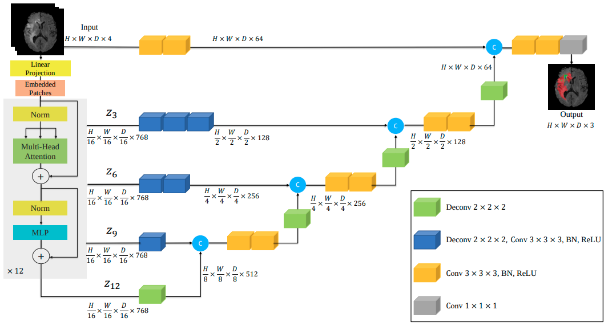

# Brain Tumor Segmentation from MRI with UNETR
The unofficial implementation of [UNETR: Transformers for 3D Medical Image Segmentation](https://arxiv.org/abs/2103.10504) on Pytorch


*Output of my implementation. (A) Ground Truth; (B) Prediction*

## UNETR
- Locality of the receptive fields in convolutional layers still limits their learning capabilities to relatively small regions. Combining self-attention modules with convolutional layers has been proposed to improve the non-local modeling capability.[1]
- UNETR utilizes a contracting-expanding pattern consisting of a stack of transformers as the encoder which is connected to a decoder via skip connections. As commonly used in NLP, the transformers operate on 1D sequence of input embeddings.[1]
## Model Architecture


*UNETR Architecture Figure from Official Paper*

# 1.Dependencies 从这里开始看
```bash
conda create -n unetr310 python=3.10
conda acrivate unetr310
pip install torch==2.6.0 torchvision==0.21.0 torchaudio==2.6.0 --index-url https://download.pytorch.org/whl/cu126
pip installl tqdm monai opencv_python einops easydict -i https://pypi.tuna.tsinghua.edu.cn/simple
pip install 'monai[all]' -i https://pypi.tuna.tsinghua.edu.cn/simple
```

# 2.Dataset
- 把百度云网盘的CTspine文件夹的数据集（也就是你给我的原始数据集）放在dataset文件夹下面即可，改名为Task044_CTspine

# 3.生成dataset.json
- 运行 [dataset_json_generate.py](dataset_json_generate.py)
- 注意修改第8行的目录

# 4.修改配置文件
- 修改[config.py](../config.py)中的内容，比如batch_size

# 5.Training
- 注意使用绝对路径，下同
- `python main.py --mode train --model_path C:\Users\Administrator\Desktop\unetr_pytorch\model\checkpoint.pth --dataset_path C:\Users\Administrator\Desktop\unetr_pytorch\dataset\Task044_CTspine`

# 6.Evaluation
- `python main.py --mode evaluate --model_path C:\Users\Administrator\Desktop\unetr_pytorch\model\checkpoint.pth --dataset_path C:\Users\Administrator\Desktop\unetr_pytorch\dataset\Task044_CTspine`

# Inference
- After model is trained, inference can be run for single data with following command.
    - `python main.py --mode inference --model_path ./path/to/model.pth --data_path ./path/to/image`
- Results will be saved to `./results/<data_name>/` for each class (TC/WT/ET).
    
## Other Implementations
- [Original Implentation](https://github.com/Project-MONAI/research-contributions/tree/main/UNETR/BTCV)
- [Self Attention CV / The AI Summer](https://github.com/The-AI-Summer/self-attention-cv)
- [SALMON v.2: Segmentation deep learning ALgorithm based on MONai toolbox](https://github.com/davidiommi/Pytorch--3D-Medical-Images-Segmentation--SALMON)

## References
- [1] [UNETR: Transformers for 3D Medical Image Segmentation](https://arxiv.org/abs/2103.10504)
- [2] [BRATS](https://www.med.upenn.edu/cbica/brats2020/previous.html)
- [3] [MONAI](https://monai.io/)
- [4] [Medical Decathlon](http://medicaldecathlon.com/)
